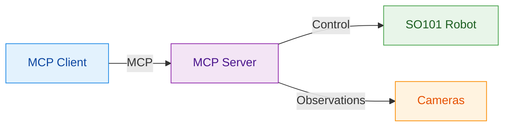

## MCP サーバー概要

MCP サーバー上で VLA ポリシが動作し、SO101 の制御とカメラ入力の関係を示すシンプルな図です。

```mermaid
flowchart LR
    Client["MCP Client"] -->|MCP| Server["MCP Server"]
    Server -->|Control| SO101["SO101 Robot"]
    Server -->|Observations| Cameras["Cameras"]

    classDef client fill:#E3F2FD,stroke:#1E88E5,stroke-width:1px,color:#0D47A1
    classDef server fill:#F3E5F5,stroke:#8E24AA,stroke-width:1px,color:#4A148C
    classDef robot fill:#E8F5E9,stroke:#43A047,stroke-width:1px,color:#1B5E20
    classDef cameras fill:#FFF3E0,stroke:#FB8C00,stroke-width:1px,color:#E65100

    class Client client
    class Server server
    class SO101 robot
    class Cameras cameras
```

短い説明:
- MCP クライアントが MCP サーバーに要求を送る
- サーバーが SO101 を制御する
- カメラ（右側）の観測をサーバーが扱う

