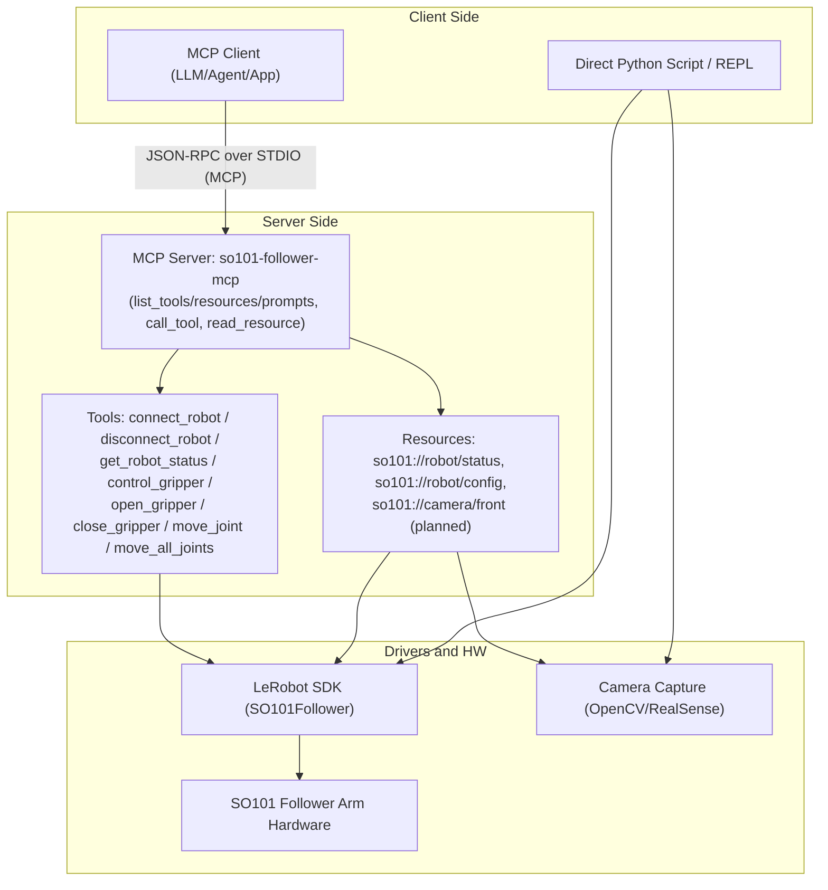
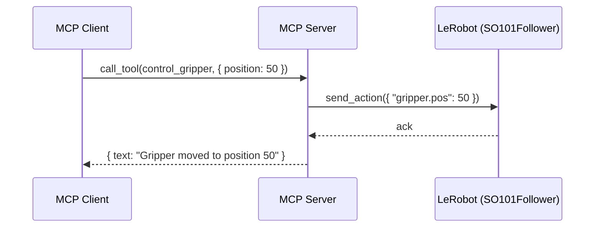
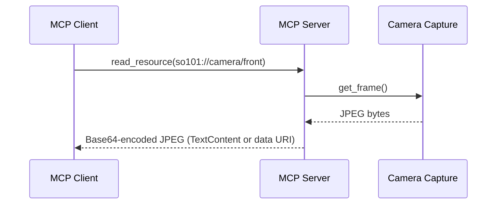

## SO101 MCP 設計ドキュメント

本書は SO101 フォロワーアームに対して、MCP (Model Context Protocol) を用いたカメラ映像アクセスと簡易サーボ制御を提供する構成を示します。MCP の基本概念は公式ドキュメントを参照してください: [MCP Introduction](https://modelcontextprotocol.io/docs/getting-started/intro).

### ゴール
- カメラ映像の取得（フレーム単位の読み出し、将来的にストリーミング）
- サーボの簡易制御（グリッパー開閉、特定ジョイント移動、複数ジョイント同時移動）
- MCP サーバーモードに加え、サーバーを立てずに直接 Python 実行でも同等機能を呼び出し可能

### 実行モード
- MCP サーバーモード: STDIO トランスポートで MCP クライアントからツール/リソースを呼び出す
- 直接 Python モード: Python スクリプト/REPL から LeRobot API を直接呼び出す（MCP を経由しない）

### コンポーネント構成（アーキテクチャ）



### ツール (Tools)
既存実装（`mcp/mcp_so101_server.py`）で提供:
- `connect_robot(port, calibrate)`
- `disconnect_robot()`
- `get_robot_status()`
- `control_gripper(position: 0-100)` / `open_gripper()` / `close_gripper()`
- `move_joint(joint, position)`
- `move_all_joints(shoulder_pan, shoulder_lift, elbow_flex, wrist_flex, wrist_roll, gripper)`

将来追加（カメラ）:
- `start_camera(name)` / `stop_camera(name)` （必要に応じて）

### リソース (Resources)
既存実装:
- `so101://robot/status`（接続状態・関節位置）
- `so101://robot/config`（接続設定の要約）

将来追加（カメラ）:
- `so101://camera/front`（最新フレームを `image/jpeg` あるいは Base64 文字列で返却）

### シーケンス（例）: グリッパー制御



### シーケンス（例）: カメラフレーム取得（設計）



### MCP サーバーモード
- STDIO トランスポートで起動し、クライアントは `list_tools` / `call_tool` / `list_resources` / `read_resource` を使用
- 参考: [MCP Introduction](https://modelcontextprotocol.io/docs/getting-started/intro)

設定例（クライアント側設定）:

```json
{
  "mcpServers": {
    "so101-follower": {
      "command": "python",
      "args": ["/Users/sy/dev/lerobot/mcp/mcp_so101_server.py"],
      "env": { "PYTHONPATH": "/Users/sy/dev/lerobot/src" }
    }
  }
}
```

### 直接 Python モード（サーバーなし）
MCP を経由せず、LeRobot を直接呼び出して同等の操作が可能です。

```python
from lerobot.robots.so101_follower import SO101Follower
from lerobot.robots.so101_follower.config_so101_follower import SO101FollowerConfig

config = SO101FollowerConfig(port="/dev/ttyUSB0", disable_torque_on_disconnect=True, max_relative_target=None, cameras={}, use_degrees=False)
robot = SO101Follower(config)
robot.connect(calibrate=True)

# グリッパーを 50% に移動
robot.send_action({"gripper.pos": 50})

# 状態取得
obs = robot.get_observation()
print(obs)

robot.disconnect()
```

カメラは OpenCV 等で直接取得できます（例: `cv2.VideoCapture` でフレーム読取り → Base64 化）。

### 安全設計のポイント
- 接続前後の状態確認 (`get_robot_status`) を推奨
- 位置コマンドは安全範囲にクリップ
- 障害時は `disconnect_robot` を確実に呼ぶ
- カメラはフレームレート調整・バックプレッシャで負荷制御

### 今後の拡張
- カメラストリーミングの正式対応（連続フレームをイベント/キューで配信）
- セーフティプロンプトの拡充（動作前チェックの自動化）
- 高度ツール（相対移動、プリセット姿勢、連携スクリプト）


